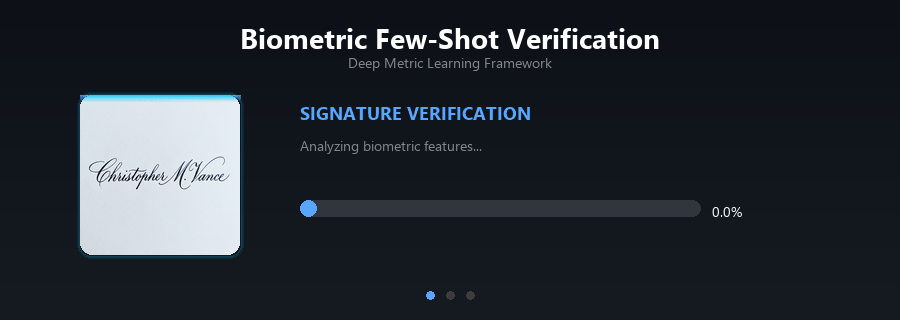

<div align="center">



<br>

# 🔐 Biometric Few-Shot Verification Framework

**Siamese Networks × Prototypical Networks × Multi-Modal Biometrics**

[](https://python.org)
[](https://pytorch.org)
[](LICENSE)
[]()

*A production-grade deep metric learning framework that verifies identities using as few as **1–5 samples** across signatures, faces, and fingerprints.*

---

[Features](#-features) · [Architecture](#-architecture) · [Quick Start](#-quick-start) · [Cloud Training](#-cloud-training-google-colab) · [Evaluation](#-evaluation--metrics) · [Contributing](#-contributing)

</div>

---

## 🎯 The Problem

Traditional biometric systems need **thousands** of images per person to learn identity patterns. In real-world security scenarios, you often have only **1 to 5** enrollment samples.

> **Our Solution:** Deep Metric Learning models that learn *how to compare* rather than *who to memorize* — enabling accurate verification from minimal data across completely different biometric types.

---

## ✨ Features

<table>
<tr>
<td width="50%">

### 🧠 Dual Architecture
- **Siamese Networks** — Pairwise comparison with Contrastive Loss
- **Prototypical Networks** — Prototype-based few-shot classification
- Shared ResNet-18 backbone with L2-normalized embeddings

</td>
<td width="50%">

### 🔬 Multi-Modal Support
- ✍️ **Signatures** — CEDAR dataset (genuine vs. forgery)
- 👤 **Faces** — AT&T/ORL + LFW datasets
- 🖐️ **Fingerprints** — SOCOFing dataset (real vs. altered)

</td>
</tr>
<tr>
<td width="50%">

### 📊 NIST-Standard Evaluation
- Equal Error Rate (EER), FAR, FRR, AUC, d-prime
- Automated ROC, DET, Score Distribution plots
- t-SNE embedding visualizations
- Multi k-shot evaluation (k = 1, 3, 5, 10)

### 🛡️ Input Validation & Cross-Modality Protection
- Heuristic-based quality checks block corrupt, blank, or tiny images.
- Soft-warnings indicate modality mismatches (e.g., uploading a face instead of a signature) without strictly blocking edge cases.

</td>
<td width="50%">

### ⚡ Hardware Flexibility
- 🟢 **NVIDIA CUDA** — Native GPU acceleration
- 🔵 **AMD DirectML** — Windows GPU support
- ⚪ **CPU** — Automatic fallback
- ☁️ **Google Colab** — One-click cloud training

### 🔄 Validation-Based Training
- Train/val/test subject-level splits
- Best-model selection by validation loss
- DataLoader-parallel batch iteration
- Centralized dataset factory & preprocessing

</td>
</tr>
</table>

---

## 🏗 Architecture

```
┌─────────────────────────────────────────────────────────────────┐
│                    INPUT: Raw Biometric Image                   │
│              (Signature / Face / Fingerprint)                   │
└──────────────────────────┬──────────────────────────────────────┘
                           │
                           ▼
┌─────────────────────────────────────────────────────────────────┐
│                 PREPROCESSING PIPELINE                          │
│  All        → Quality & Modality Validation (Heuristics)       │
│  Signatures → Otsu Binarization + Inversion                    │
│  Faces      → Histogram Equalization                           │
│  Fingerprints → CLAHE Enhancement                              │
│  All        → Albumentations Augmentation                      │
└──────────────────────────┬──────────────────────────────────────┘
                           │
                           ▼
┌─────────────────────────────────────────────────────────────────┐
│                   RESNET-18 BACKBONE                            │
│    1-ch Grayscale → 512-d → 256 → ReLU → Dropout → 128-d      │
│                      (L2 Normalized)                            │
└──────────┬───────────────────────────────────────┬──────────────┘
           │                                       │
           ▼                                       ▼
┌─────────────────────────┐         ┌─────────────────────────────┐
│    SIAMESE NETWORK      │         │   PROTOTYPICAL NETWORK      │
│                         │         │                             │
│  Img_A ──┐              │         │  Support Set → Prototypes   │
│          ├─→ |emb diff| │         │  Query ──→ Distance to each │
│  Img_B ──┘   → Score    │         │           → Classification  │
│                         │         │                             │
│  Loss: Contrastive      │         │  Loss: Prototypical (NLL)   │
└─────────────────────────┘         └─────────────────────────────┘
           │                                       │
           └───────────────┬───────────────────────┘
                           │
                           ▼
┌─────────────────────────────────────────────────────────────────┐
│                    EVALUATION ENGINE                            │
│    EER · FAR · FRR · AUC · d-prime · ROC · DET · t-SNE         │
└─────────────────────────────────────────────────────────────────┘
```

---

## 📁 Project Structure

```
LAP/
│
├── 📂 configs/                    # Experiment configurations (YAML)
│   ├── siamese_signature.yaml
│   ├── siamese_face.yaml
│   ├── siamese_fingerprint.yaml
│   ├── proto_signature.yaml
│   ├── proto_face.yaml
│   └── proto_fingerprint.yaml
│
├── 📂 data/                       # Data pipeline
│   ├── base_loader.py             # Abstract dataset with in-memory caching
│   ├── dataset_factory.py         # Centralized get_dataset() entry point
│   ├── preprocessing.py           # Shared preprocessing & IMAGE_SIZES registry
│   ├── pair_dataset.py            # DataLoader wrapper for Siamese pairs
│   ├── episode_dataset.py         # DataLoader wrapper for Proto episodes
│   ├── signature_loader.py        # CEDAR + BHSig260 loaders
│   ├── face_loader.py             # AT&T/ORL + LFW loaders
│   ├── fingerprint_loader.py      # SOCOFing loader
│   ├── samplers.py                # PairSampler + EpisodeSampler
│   └── augmentations.py           # Per-modality augmentation pipelines
│
├── 📂 models/                     # Network architectures
│   ├── backbone.py                # ResNet-18 + LightCNN encoders
│   ├── siamese.py                 # Siamese Network
│   └── prototypical.py            # Prototypical Network
│
├── 📂 losses/                     # Loss functions
│   └── losses.py                  # Contrastive, Prototypical, Triplet, BCE
│
├── 📂 training/                   # Training engine
│   └── trainer.py                 # Unified training loop with validation split
│
├── 📂 evaluation/                 # Evaluation & visualization
│   ├── metrics.py                 # EER, FAR, FRR, AUC, d-prime
│   ├── visualize.py               # ROC, DET, t-SNE, score distributions
│   └── benchmark.py               # Cross-config benchmark runner
│
├── 📂 inference/                  # Production inference API
│   ├── api.py                     # FastAPI REST server
│   ├── engine.py                  # Core inference logic & caching
│   ├── validation.py              # Input validation & cross-modality checks
│   └── enrollment_store.py        # User ID → prototype memory mapping
│
├── 📂 tests/                      # Automated test suite
│   ├── test_data_loading.py       # Dataset & DataLoader integration tests
│   ├── test_dataloader_training.py# End-to-end training loop tests
│   ├── test_model_correctness.py  # Model architecture & forward pass tests
│   ├── test_preprocessing.py      # Preprocessing pipeline tests
│   ├── test_validation.py         # Input validation tests
│   └── ...                        # API, engine, enrollment store tests
│
├── 📂 ui/                         # Web Frontend Diagnostics
│   ├── index.html                 # Drag & drop Web UI
│   ├── css/style.css              # Glassmorphism dark-theme styling
│   └── js/app.js                  # API integration logic
│
├── 📂 results/                    # 🚫 Git-ignored (checkpoints + figures)
├── 📂 data/raw/                   # 🚫 Git-ignored (dataset images)
│
├── train.py                       # 🏋️ Local training entry point
├── evaluate.py                    # 📊 Evaluation entry point
├── colab_train.py                 # ☁️ All-in-one Colab training script
├── download_datasets.py           # 📥 Automated dataset downloader
├── utils.py                       # 🔧 Device detection (DirectML/CUDA/CPU)
├── requirements.txt               # 📦 Python dependencies
└── PROJECT_DOCUMENTATION.md       # 📖 Full engineering documentation
```

---

## 🚀 Quick Start

### Prerequisites

- Python 3.10+
- Git

### 1️⃣ Clone & Install

```bash
git clone https://github.com/AtakanEcevit/LAP-2526.git
cd LAP-2526

python -m venv venv
venv\Scripts\activate          # Windows
# source venv/bin/activate     # macOS/Linux

pip install -r requirements.txt
```

### 2️⃣ Download Datasets

```bash
python download_datasets.py
```

This downloads and extracts the freely available datasets:

| Modality | Dataset | Subjects | Images | Type | Auto-Download |
|:--------:|:-------:|:--------:|:------:|:----:|:-------------:|
| ✍️ Signature | CEDAR | 55 | 2,640 | Genuine + Forgery | ❌ Manual |
| 👤 Face | AT&T/ORL | 40 | 400 | Multi-pose | ✅ |
| 👤 Face | LFW | 5,749 | 13,000+ | In-the-wild | ✅ |
| 🖐️ Fingerprint | SOCOFing | 600 | 6,000 | Real + Altered | ✅ |

> ⚠️ **CEDAR** must be downloaded manually from [cedar.buffalo.edu](https://cedar.buffalo.edu/NIJ/data/) and extracted to `data/raw/signatures/CEDAR/`.

### 3️⃣ Train a Model

```bash
python train.py --config configs/siamese_signature.yaml
```

### 4️⃣ Evaluate

```bash
python evaluate.py \
  --config configs/siamese_signature.yaml \
  --checkpoint results/siamese_signature_cedar/checkpoints/best.pth
```

> 📁 Outputs (ROC plots, metrics, t-SNE maps) are saved to `results/*/figures/`

### 5️⃣ Run the Production API & Web UI

Start the FastAPI inference server to interact with the models via a graphical interface.

```bash
# Install additional API dependencies
pip install -r requirements-api.txt

# Start the backend server
uvicorn inference.api:app --host 127.0.0.1 --port 8000
```

Once the server is running:
- Open `ui/index.html` in any web browser to access the drag-and-drop diagnostic UI.
- Navigate to `http://127.0.0.1:8000/docs` to view the interactive API documentation.

---

## ☁️ Cloud Training (Google Colab)

For significantly faster training using free NVIDIA A100/T4 GPUs:

<details>
<summary><b>📋 Step-by-step Colab Instructions</b></summary>

1. **Prepare data locally:**
   ```bash
   # Creates data_raw.zip preserving folder structure
   python create_zip.py
   ```

2. **Upload to Google Drive:**
   - Upload `data_raw.zip` and `colab_train.py` to your Drive root.

3. **In a Colab notebook** (Runtime → GPU):
   ```python
   from google.colab import drive
   drive.mount('/content/drive')

   !cp /content/drive/MyDrive/data_raw.zip .
   !cp /content/drive/MyDrive/colab_train.py .
   !python colab_train.py
   ```

4. **Download results:**
   ```python
   !cp /content/results_best.zip /content/drive/MyDrive/
   ```

> 💡 The script auto-discovers dataset paths, trains all 6 models sequentially, and packages the best checkpoints.

</details>

---

## 📊 Evaluation & Metrics

The framework produces comprehensive biometric verification metrics:

| Metric | Description | Ideal Value |
|:------:|:-----------:|:-----------:|
| **EER** | Equal Error Rate — where FAR = FRR | → 0% |
| **FAR** | False Acceptance Rate (security) | → 0% |
| **FRR** | False Rejection Rate (convenience) | → 0% |
| **AUC** | Area Under ROC Curve | → 1.0 |
| **d-prime** | Distribution separation measure | → ∞ |

### Generated Visualizations

Each evaluation run automatically produces:

- 📈 **ROC Curves** — Per k-shot (1, 3, 5, 10)
- 📉 **DET Curves** — NIST-standard detection error tradeoff
- 📊 **Score Distributions** — Genuine vs. impostor overlap
- 🗺️ **t-SNE Maps** — 2D embedding cluster visualization

---

## ⚙️ Configuration

All experiments are driven by YAML configs in `configs/`:

```yaml
model:
  type: siamese           # 'siamese' or 'prototypical'
  backbone: resnet         # 'resnet' or 'light'
  embedding_dim: 128
  pretrained: true

dataset:
  modality: signature      # 'signature', 'face', or 'fingerprint'
  name: cedar
  root_dir: data/raw/signatures/CEDAR

training:
  epochs: 50
  batch_size: 32
  lr: 0.0001
  patience: 15             # Early stopping

evaluation:
  k_shots: [1, 3, 5, 10]
```

### Available Configs

| Config | Model | Modality | Dataset |
|:------:|:-----:|:--------:|:-------:|
| `siamese_signature.yaml` | Siamese | Signature | CEDAR |
| `proto_signature.yaml` | Prototypical | Signature | CEDAR |
| `siamese_face.yaml` | Siamese | Face | AT&T |
| `proto_face.yaml` | Prototypical | Face | AT&T |
| `siamese_fingerprint.yaml` | Siamese | Fingerprint | SOCOFing |
| `proto_fingerprint.yaml` | Prototypical | Fingerprint | SOCOFing |

---

## 🤝 Contributing

Contributions are welcome! To get started:

1. **Fork** the repository
2. **Create** a feature branch (`git checkout -b feature/amazing-feature`)
3. **Commit** your changes (`git commit -m 'Add amazing feature'`)
4. **Push** to the branch (`git push origin feature/amazing-feature`)
5. **Open** a Pull Request

> ⚠️ Please ensure `evaluate.py` completes without errors on your changes before submitting a PR.

---

## 📄 Documentation

### 📋 Project Overview — *Non-Technical Stakeholder Summary*

<details>
<summary><b>Click to expand the Project Overview</b></summary>

<br>

#### 1. What This Project Does (The Big Picture)

This project is an advanced Artificial Intelligence (AI) system designed to verify a person's identity using their unique physical or behavioral traits—specifically their **signatures**, **faces**, and **fingerprints**.

Think of it like a highly trained digital security guard. When someone presents a signature on a document, a fingerprint on a scanner, or their face to a camera, this system can instantly compare it against known examples to determine if it is genuine or a forgery.

#### 2. Why It Matters (The Problem It Solves)

In the digital age, unauthorized access, identity theft, and forgery are major risks. Traditional AI security systems often require thousands of examples of a person's signature or face to learn how to recognize them accurately.

This project solves that problem through a powerful capability called **"Few-Shot Learning."** This means the system can accurately verify an identity or detect a forgery even if it has only seen a tiny handful of genuine examples (sometimes as few as 1 to 5). This makes the system extremely practical for real-world scenarios where you cannot ask a user to provide hundreds of sample signatures or photos.

#### 3. How It Works (Main Features Explained Simply)

To ensure the highest accuracy, the system uses two distinct "brain architectures" (AI models) that approach the problem in different ways:

**A. The "Direct Comparison" Approach (Siamese Networks)**
Imagine holding a known genuine signature in your left hand and a new, questionable signature in your right hand. You examine them side-by-side to spot differences in loops, pressure, or shape.
* **What it does:** It takes two samples, looks at them simultaneously, and calculates a directly measurable "similarity score."
* **Why it is useful:** It is incredibly good at spotting direct discrepancies between a real sample and a high-quality forgery.

**B. The "Mental Average" Approach (Prototypical Networks)**
Imagine you've seen a friend's face several times. You develop a mental image—a "prototype"—of what they look like on average. If you see a person who looks slightly different, you compare them to that mental average to decide if it's really your friend.
* **What it does:** It looks at the few genuine examples provided and creates a mathematical "average" (the prototype) of that person's traits. New samples are then compared to this single, robust average.
* **Why it is useful:** It handles natural variations incredibly well. For example, if your signature looks slightly different when you are in a hurry, this system is less likely to accidentally reject it.

**C. Multi-Modal Flexibility**
* The system handles and switches between three distinct human traits: **Signatures** (handwriting patterns), **Faces** (facial geometry), and **Fingerprints** (microscopic ridge details).
* This allows organizations to plug this single, unified framework into completely different environments (e.g., banking software for signatures, or a physical building turnstile for faces).

**D. Flexible Hardware Support**
* The project supports multiple hardware backends: NVIDIA CUDA GPUs (including free cloud GPUs via Google Colab), AMD GPUs via Microsoft DirectML, and standard CPUs. For practical training speed, a dedicated Google Colab integration script leverages powerful cloud GPUs (A100/T4) at no cost.

#### 4. What the System Produces (Outputs and Results)

When the system runs, it produces detailed, actionable outputs:

* **Trained Security Models:** The final, packaged "brain" ready to be plugged into an app or software to start verifying users immediately.
* **Similarity Scores & Thresholds:** For every scan or signature, the system provides a precise confidence score. Administrators can manually adjust the strictness threshold.
* **Performance Visualizations:** The project automatically generates ROC and DET curves that visually prove how accurate the system is.
* **Separation Maps (t-SNE Embeddings):** Intuitive visual maps showing genuine signatures cleanly separated from forgeries, providing proof of security to non-experts.

> **Summary:** This project provides a flexible, highly accurate, and privacy-friendly way to verify identities and stop forgeries using only a fraction of the data traditional systems require.

</details>

---

### 🔧 Engineering Documentation — *Full Technical Reference*

<details>
<summary><b>Click to expand the Engineering Documentation</b></summary>

<br>

This document serves as the comprehensive guide to the **Biometric Few-Shot Verification** project. It outlines the architecture, data pipelines, model designs, training methodologies, and evaluation processes.

---

#### 1. Project Overview & Objectives

**The Problem:** Traditional biometric classification systems require thousands of images per class (person) to train effectively. In real-world security scenarios, you often only have 1 to 5 enrollments (images) of a person.

**The Solution:** We implemented **Deep Metric Learning** approaches — specifically Siamese Networks and Prototypical Networks — which learn a generalized "distance metric" instead of memorizing specific people.

**Core Modalities Supported:**
1. **Signatures:** CEDAR dataset (Genuine vs. Forgery)
2. **Faces:** AT&T (ORL) dataset and Labeled Faces in the Wild (LFW)
3. **Fingerprints:** SOCOFing dataset (Real vs. Altered)

---

#### 2. System Architecture & Components

##### A. Data Pipeline (`data/`)

1. **`base_loader.py` (BiometricDataset)**
   - Abstract base class defining the blueprint for all data loaders. Handles `__len__`, indexing genuine/forgery splits, applying Albumentations transforms, and an **in-memory caching system** that accelerates training by orders of magnitude.

2. **Modality-Specific Loaders** (`signature_loader.py`, `face_loader.py`, `fingerprint_loader.py`)
   - Each loader inherits from `BiometricDataset` and implements `_load_data()` and `_preprocess()`.
   - **Pre-processing:**
     - *Signatures:* Grayscale -> Otsu Binarization -> Conditional Inversion (if mean pixel < 127) -> Resized to 155x220
     - *Faces:* Histogram Equalization (lighting normalization) -> Resized to 105x105
     - *Fingerprints:* CLAHE (local contrast enhancement) -> Resized to 96x96

3. **Augmentations (`augmentations.py`)**
   - Signatures: elastic transforms, shift/scale/rotate, Gaussian noise
   - Faces: horizontal flips, rotations, brightness/contrast shifts
   - Fingerprints: conservative rotations, elastic transforms, Gaussian noise
   - All: random brightness/contrast + Gaussian blurring

4. **Samplers (`samplers.py`)**
   - **`PairSampler`:** For Siamese networks. 50% Genuine / 50% Impostor pairs.
   - **`EpisodeSampler`:** For Prototypical networks. N-way, K-shot episodes.

##### B. Model Architectures (`models/`)

1. **The Backbone (`backbone.py`)**
   - **`ResNetEncoder`:** Modified ResNet-18 with 1-channel grayscale input, embedding pipeline: `Linear(512->256)` -> `ReLU` -> `Dropout(0.3)` -> `Linear(256->128)` -> **L2 Normalization**
   - **`LightCNNEncoder`:** 4-block CNN alternative (Conv->BN->ReLU->MaxPool x4) for faster experimentation. Outputs L2-normalized 128-d embeddings.

2. **The Siamese Network (`siamese.py`)**
   - Takes two images, extracts embeddings, computes `|emb1 - emb2|`, and passes the absolute difference through a classifier head to output a similarity score (0.0 to 1.0).

3. **The Prototypical Network (`prototypical.py`)**
   - Encodes support images, averages them into a "Prototype" vector per class, then classifies queries by distance to each prototype (Euclidean or Cosine).

##### C. Losses (`losses/losses.py`)

1. **Contrastive Loss:** Pushes same-person embeddings together, pulls different-person apart to a margin.
2. **Triplet Loss:** Enforces `d(anchor, positive) < d(anchor, negative) + margin`.
3. **Prototypical Loss:** Log-softmax over negative distances to prototypes (dynamic cross-entropy).
4. **Binary Cross-Entropy Loss:** Alternative for Siamese networks using the sigmoid similarity score directly.

---

#### 3. The Execution Flow

##### A. Training & Hardware Constraints

**The DirectML Challenge:**
The user hardware (AMD RX 9070 XT) required `torch-directml`. We encountered a `BatchNorm2d` crash due to Turkish locale encoding. *Workaround:* Replaced with `nn.Identity` locally and forced `PYTHONUTF8=1`. DirectML remained too slow.

**The Colab Solution (`colab_train.py`):**
The entire codebase was packed into a single script for Google Colab CUDA GPUs (A100/T4). Auto-discovers dataset paths, runs all 6 configurations sequentially, and packages the best checkpoints.

##### B. Evaluation Pipeline (`evaluate.py`)

**Metrics (`metrics.py`):**
| Metric | Description |
|:------:|:-----------:|
| Accuracy | Basic correct/incorrect thresholding |
| EER | Equal Error Rate — where FAR = FRR |
| FAR & FRR | False Acceptance / False Rejection Rates |
| AUC | Area Under ROC Curve |
| d-prime | Distribution separation measure |

**Visualizations (`visualize.py`):**
| Plot | Description |
|:----:|:-----------:|
| ROC Curves | True Positive Rate vs False Positive Rate |
| DET Curves | Detection Error Tradeoff (Log-Log scale) |
| Score Distributions | Genuine vs impostor score histograms |
| t-SNE Maps | 2D projections of 128-d embeddings |

---

#### 4. Dependencies & Configurations

Configs are YAML files in `configs/` controlling: backbone choice, embedding dimensions, learning rates, margins, batch sizes, dataset paths, and early-stopping patience.

**Requirements:** `torch>=2.1.0`, `torchvision>=0.16.0`, `torch-directml>=0.2.0`, `albumentations>=1.3.0`, `opencv-python>=4.8.0`, `scikit-learn>=1.3.0`, `matplotlib>=3.7.0`, `seaborn>=0.12.0`, `tqdm>=4.65.0`, `pyyaml>=6.0`, `tensorboard>=2.14.0`, `numpy>=1.24.0`, `Pillow>=10.0.0`

</details>

---

### 📝 Additional Documents

| Document | Description |
|:--------:|:-----------:|
| [`PROJECT_OVERVIEW.md`](PROJECT_OVERVIEW.md) | Standalone non-technical overview |
| [`PROJECT_DOCUMENTATION.md`](PROJECT_DOCUMENTATION.md) | Standalone engineering reference |
| [`RELEASE_NOTES.md`](RELEASE_NOTES.md) | Version history & changelog |

---

<div align="center">

**Built with** ❤️ **using PyTorch**

`v1.2.0`

</div>
